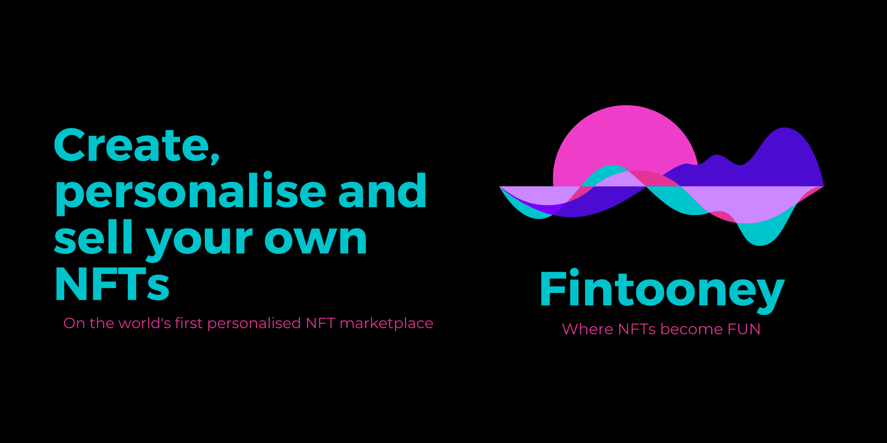
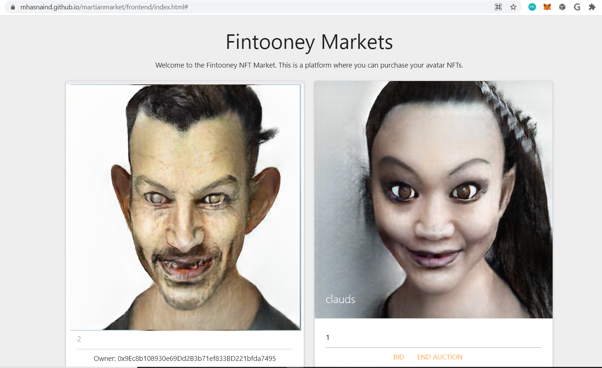

# Project 3 - Non-Fungible Fun

## Project Team
Mike Rae, Grace Ho, Mikhara Ramsing, Muhammad Dosani

Sydney University Fintech Bootcamp - Project 3

Due 14 September 2021

&nbsp;

## Project outline
1. NFT Concept - NonFungible Fun
2. Utilising AI (eg Toonify API) to alter images and create NFT Avatars
3. Creation of token and crowdsale
4. Auction and bid contract
5. Summary
6. Key learnings 

&nbsp;

## 1. NFT Concept - Non-Fungible Fun
Non-Fungible Tokens have seen an immense growth in popularity in recent times.  In the first half of 2021 alone, NFT sales volumes surged to US$2.5b [1].  Despite the popularity of NFTs, it was observed that there were not personalisable or customisable NFTs available to the general public. 

This project seeks to demonstrate the ability to offer personalisable NFTs to the public, and the use of ERC20 fungible tokens to purchase ERC721 non fungible tokens.

Conceptually, the end to end process would occur on a central, polished web based graphical user interface.  That is, images are loaded & personalised (avatars created), ERC20 tokens purchased and NFT auction takes place. However, as website development is outside the scope of the Fintech Bootcamp, the functional capabilities are demonstrated separately, as outlined below.

Personalisable Image alteration:
* A consumer or NFT seller can upload image(s) to a website, and the image is altered to create personalised avatar images (using machine learning / AI).
* The personalised avatar image is submitted to IPFS via Pinata.

Tokenisation and auction:
* Fungible ERC20 tokens (TOON) are created and distributed via a Crowdsale.^
* The personalisable avatar is turned into an ERC721 NFT, and available for purchase via an auction process.

^ Our research and tests highlighted the complexity in adapting Open Zeppelin code to accept a specific ERC20 token for a NFT auction.  Due to time limitations associated with this project, we were unable to finalise a TOON ERC20 token to purchase the ERC721 NFTs.  Instead, our NFT auction (as per Open Zeppelin code) will accept testnet ETH as payment.

&nbsp;

## 2. Utilising AI to alter images and create NFT Avatars
Using Python, we connected to the Toonify API via RapidAPI.  Our code accepts an image, and transformed the image into an altered avatar based on the selected transformation setting (eg comic, zombify etc). The Toonify API provides a number of image alteration options using machine learning, including transforming into cartoon, comic, halloween style images.  These can be easily specified within the python code.

The avatar image is then submitted to IPFS via Pinata, and a Pinata link returned.

Dependencies: Requires Rapid API & Pinata keys.

Refer to '1_Toonify_Python_API_Integration.ipynb' for the python code.

Refer to '2_Image register.xls' for the full set of altered images and their Pinata or CID links.

&nbsp;

## 3. Creation of token and crowdsale
**a) FintooneyCoin Contract**
A FinTooneyCoin (TOON) token was created, intended for purchasing the personalised avatar NFT's on the FinTooney NFT Market place.  While TOON was intended as the currency required in the NFT auction, as mentioned above, the final auction code accepted testnet ETH only (due to code complexity and time limitations to complete the project).

Refer '3_FintooneyCoin.sol' file. 

**b) Crowd sale contract**
The crowd sale contract and deployer was built to allow for the initial crowdsale of FinTooneyCoin and tested locally on solidity as well as Ganache and Rinkeby Testnets.

Refer '4_FintooneyCrowdsale.sol' file. 

To deploy - deploy the '4_FintooneyCrowdsale.sol' file (eg in Remix).  This file will automatically trigger the deployment of the '3_FintooneyCoin.sol' file.

However, as outlined earlier, '3_FintooneyCoin.sol' & '4_FintooneyCrowdsale.sol' were not ultimately used in our NFT auction.

&nbsp;

## 4. Auction and Market contract

**a) Auction Contract**

The Auction contract set up the rules of the Fintooney Market. Namely:

* Bid time- the user is asked to enter the Bidding Time and seconds bidding time on behalf of the beneficiary.
* Bid - user is asked to place their bid and are notified that value bid is only refunded if they are not the Highest Bidder.
* Highest bidder - if the amount bid is not the highest, the user has the ability to withdraw their bid.
* Withdraw bid - user can recall this function again as part of their receiving call before send returns.
* Auction ends - the following phases are run in sequence: conditions are checked (end of auction and deployer), performing actions (auction has ended), and interaction (transferred to beneficiary address of highest bidder).

Note - The Fintooney Coin (TOON) was attempted to be set as the only Token that could be used to bid in the auction. Two methods were tried:

1. isContract - tried to require isContract to be set to Fintooney Coin.
2. SpenderRole - introduced SpenderRole to see if FinTooney Coin Spender functions meant you could only spend TOON.

Both did not work. Two main complexities that would arise from using the TOON token that are worth noting:
* How to check the balance of TOON in bidder wallet noting in solidity, the wallet could hold mutiple tokens and how to check the address;
* How to check the amount of TOON they have available for multiple NFTS, how to check all and in order.

Refer '5_FintooneyAuction.sol' file.

**b) Market Contract**

The Fintooney Market contract set up the market in which to bid for NFTs. The Market can run multiple Auction Contracts. An Auction Contract is required for each NFT. The market contract does the following:

* Enabled the use of ETH to bid on NFT (ideally this would be TOON in future);
* Creates a Foundation which facilitates the transactions for each auction and owns the NFTs (mint function);
* Checks the registration ID of the NFT present at auction;
* Mint function that mints the NFT;
* Checks the balance of the bidder;
* Ensures highest bidder payment goes to the Foundation.

Refer '6_FintooneyMarket.sol' file.

To deploy - 
* Deploy the '6_FintooneyMarket.sol' file (eg in Remix).  This file will automatically trigger the deployment of the '5_FintooneyAuction.sol' file.  
* The deployed contract address of the '6_FintooneyMarket.sol' file should be pasted in line 2 of the dapp.js file (front end folder). 
* The ABI files for both '5_FintooneyAuction.sol' and '6_FintooneyMarket.sol' files should be pasted in their respective .json files (front end folder).
* The front end files can be hosted using an Ethereum Testnet (eg Rinkeby) and GitHub Pages.  
* The front end will allow bids to occur on specific NFTs and displays the owner once the NFT has been successfully purchased via the auction.  See image below:

&nbsp;

## 5. Summary
Our project aimed to provide a differentiated experience by creating a personalisable NFTs marketplace.  We utilised Python to integrate machine learning powered image alteration (Toonify via RapidAPI) to produce avatar NFTs and image storage via IPFS.  Solidity smart contracts were built to create the tokens (ERC20 fungible for TOON coins and ERC721 non-fungible for personalised avatar NFTs), and a public auction.

&nbsp;

## 6. Key learnings 
a) Web based graphical user interface for end to end process
Ideally, we would have created a polished, front end web based GUI (using html and javascript) containing both the functionality for the consumer to load images & select their altered avatar, as well as ability to exchange Ether for TOON tokens and purchase the NFT.  However, web development is outside the scope of this course.

b) Image conversion
Additional complexity was discovered after integrating the API layer in which the returned file was the image in bytes. Code was added to allow for the bytes to be converted back to an image.

c) Auction Purchase Currency
Generally NFT's are traded using ETH.  While our project objective was to add a requirement that Fintooney NFTs could only be purchased using FinTooneyCoin (rather than ETH), it was found to be too complex to resolve within our time limitations.

&nbsp;

## References: 
1. Reuters, https://www.reuters.com/technology/nft-sales-volume-surges-25-bln-2021-first-half-2021-07-05/

&nbsp;

--END--